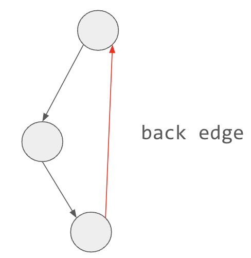

## Analysis

This problem is to find the cycle in the directed graph. The core part is to detect the back edge. 



We will run a series of DFS in the graph. Initially all vertices are colored white (0). From each unvisited (white) vertex, start the DFS, mark it gray (1) while entering and mark it black (2) on exit. If DFS moves to a gray vertex, then we have found a cycle. The cycle itself can be reconstructed using parent array.


## Code

```c++
#include <bits/stdc++.h>
using namespace std;

int N, M;

vector<vector<int>> adj;
vector<int> visited;
vector<int> parent;

int cycle_start, cycle_end;

// return true if has cycle
bool dfs(int cur) {
    visited[cur] = 1;
    for (const auto nb: adj[cur]) {
        if (visited[nb] == 0) {
            parent[nb] = cur;
            if (dfs(nb)) {
                return true;
            }
        } else if (visited[nb] == 1) {
            // found a cycle
            cycle_start = nb;
            cycle_end = cur;
            return true;
        }
    }
    visited[cur] = 2;
    return false;
}

int main() {
    cin >> N >> M;
    adj.resize(N);
    for (int i = 0; i < M; ++i) {
        int from, to;
        cin >> from >> to;
        from--;
        to--;
        adj[from].push_back(to);
    }

    cycle_start = cycle_end = -1;
    visited.resize(N);
    parent.resize(N);

    bool has_cycle = false;
    for (int i = 0; i < N; ++i) {
        if (visited[i] == 0 && dfs(i)) {
            has_cycle = true;
            break;
        }
    }
    if (has_cycle) {
        vector<int> cycle;
        cycle.push_back(cycle_start);
        for (int v = cycle_end; v != cycle_start; v = parent[v]) {
            cycle.push_back(v);
        }
        cycle.push_back(cycle_start);
        reverse(cycle.begin(), cycle.end());
        cout << cycle.size() << "\n";
        for (const auto node: cycle) {
            cout << node + 1 << " ";
        }
    } else {
        cout << "IMPOSSIBLE\n";
    }
    return 0;
}
```